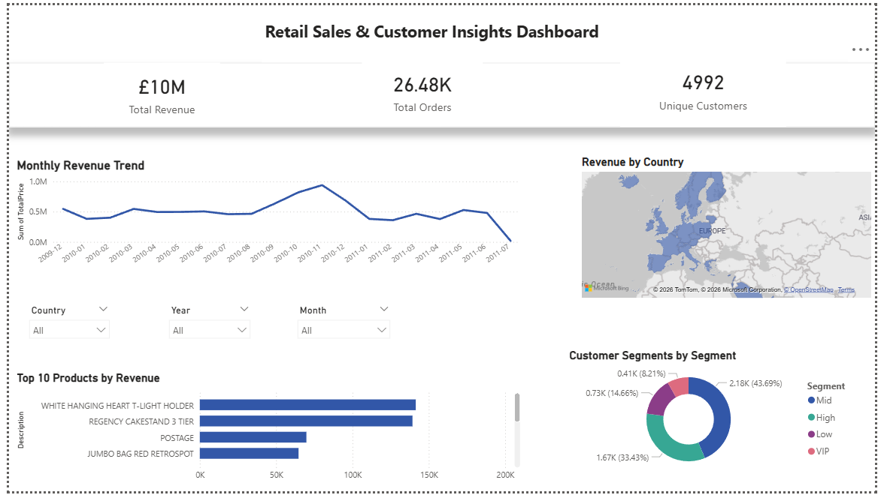

# Retail Sales & Customer Insights Dashboard

An end-to-end data analytics project analyzing 500K+ retail transactions to uncover revenue trends, customer segments, and product performance — built with Python, SQL, and Power BI.



---

## Tech Stack

| Layer | Tools |
|---|---|
| Data Cleaning & EDA | Python, Pandas, NumPy, Matplotlib, Seaborn |
| Database & Querying | SQL (SQLite), Window Functions, CTEs |
| Dashboard | Power BI Desktop |
| Version Control | Git, GitHub |

---
## Project Structure

```
retail_analytics/
│
├── analysis/
│   ├── data_cleaning.py       # Data cleaning & feature engineering
│   └── eda.py                 # Exploratory data analysis & charts
│
├── data/
│   ├── retail_data.csv        # Raw dataset (UK Online Retail II)
│   └── clean_data.csv         # Cleaned dataset (output)
│
├── sql/
│   ├── load_to_db.py          # Loads data into SQLite database
│   └── run_queries.py         # SQL analysis queries
│
├── exports/
│   ├── monthly_revenue.png    # Monthly revenue chart
│   ├── top_products.png       # Top 10 products chart
│   ├── rfm_segments.csv       # RFM customer segments
│   ├── monthly_revenue_sql.csv
│   ├── top_customers.csv
│   └── top_product_country.csv
│
└── retail_analysis.pbix       # Power BI dashboard file
```

---

## Dataset

- **Source:** UK Online Retail II — Kaggle
- **Size:** 500K+ transactions

---

## What I Did

### 1. Data Cleaning (`analysis/data_cleaning.py`)
- Removed 135K+ rows with missing Customer IDs
- Filtered out cancellations (invoices starting with 'C') and negative quantities
- Engineered new features: `TotalPrice`, `Month`, `Year`, `DayOfWeek`, `Hour`
- Applied percentile-based outlier removal (1st–99th) using NumPy

### 2. Exploratory Data Analysis (`analysis/eda.py`)
- Plotted monthly revenue trend using Seaborn line chart
- Identified top 10 revenue-generating products using bar chart
- Computed revenue by country
- Built RFM (Recency, Frequency, Monetary) model to segment 4,992 customers

### 3. SQL Analysis (`sql/`)
- Loaded cleaned data into a normalized SQLite database with 4 tables
- Wrote advanced SQL queries using CTEs, window functions, RANK(), PARTITION BY
- Key queries: cumulative revenue, customer LTV ranking, top product per country, top 20% revenue contribution

### 4. Power BI Dashboard (`retail_analysis.pbix`)
- Built an interactive dashboard with 5 visuals and 3 slicers
- KPI cards: Total Revenue (£9.98M), Total Orders (26.48K), Unique Customers (4,992)
- Dynamic filtering by Country, Year, and Month

---

## How to Run

### Prerequisites
```bash
pip install pandas numpy matplotlib seaborn
```

### Steps
```bash
# 1. Clone the repo
git clone https://github.com/Chahat3114/Retail-Sales-Customer-Insights-Dashboard
cd retail_analytics

# 2. Run data cleaning
python analysis/data_cleaning.py

# 3. Run EDA (generates charts in exports/)
python analysis/eda.py

# 4. Load data into SQLite
python sql/load_to_db.py

# 5. Run SQL queries
python sql/run_queries.py

# 6. Open Power BI dashboard
# Open retail_analysis.pbix in Power BI Desktop
```

## Dashboard Features

- **Monthly Revenue Trend** — Line chart showing revenue
- **Top 10 Products by Revenue** — Horizontal bar chart with Top N filter
- **Revenue by Country** — Filled map with geographic revenue distribution
- **Customer Segments** — Donut chart showing RFM-based segmentation
- **Interactive Slicers** — Filter entire dashboard by Country, Year, and Month

## Key Insights

- **Top 20% of customers drove ~65% of total revenue** — Pareto principle confirmed
- **November 2010 was the peak revenue month** at £1.0M — pre-holiday shopping spike
- **United Kingdom accounts for 84.8%** of total revenue (£8.46M out of £9.98M)
- **43.69% of customers are "Mid" segment** — largest growth opportunity
- **White Hanging Heart T-Light Holder** is the highest revenue-generating product

---

## Author

**Chahat Singhal**
